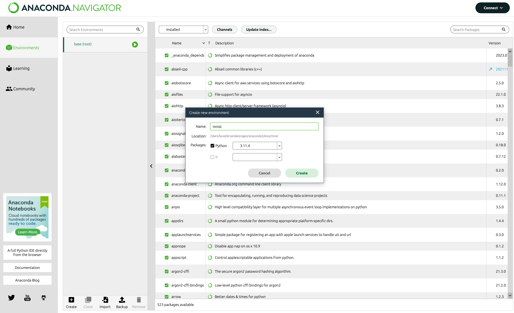
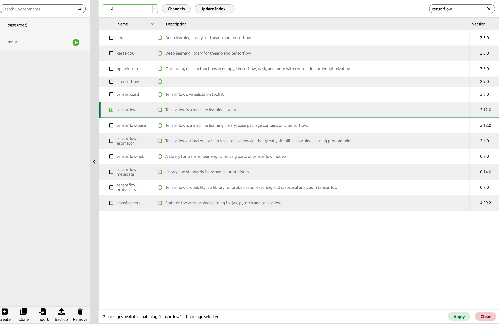
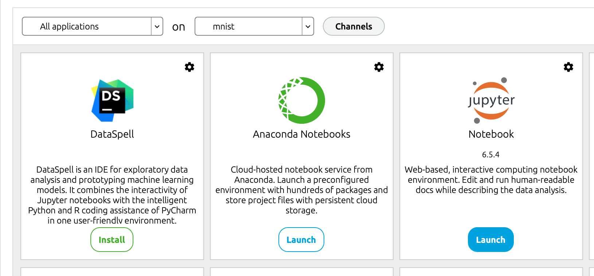

# Curso Nivelador IA

> Repositorio para el curso nivelador de IA

## Introducción

En esta sesión vamos a abordar los conceptos clave para empezar a trabajar con Python y orientar los conocimientos hacia el desarrollo de aplicaciones de Inteligencia Artificial. Los recursos fundamentales que vamos a utilizar son:

- [Python](https://www.python.org/)
- [Anaconda](https://www.anaconda.com/)
- [Jupyter Notebook](https://jupyter.org/)
- [Google Colab](https://colab.research.google.com/)
- [Github](https://github.com/)
- [Git](https://git-scm.com/)
- [ChatGPT](https://chat.openai.com/)
- [Hugging Face](https://huggingface.co/)

## Github

Github es una plataforma de desarrollo colaborativo de software para alojar proyectos utilizando el sistema de control de versiones Git. El código se almacena de forma pública, aunque también se puede hacer de forma privada, creando una cuenta gratuita. Github es una plataforma muy utilizada por los desarrolladores de software, ya que permite trabajar de forma colaborativa en un mismo proyecto, además de poder compartir el código con el resto de la comunidad.

Lo primero de todo será registraros en Github, podéis hacerlo en el [siguiente enlace](https://github.com/signup). El registro es gratuito, podéis seguir las [instrucciones de la documentación](https://docs.github.com/es/get-started/signing-up-for-github/signing-up-for-a-new-github-account). Una vez registrados, podéis acceder al repositorio del curso siguiendo este enlace [Curso Nivelador IA](https://github.com/lucferbux/Curso-Nivelador-IA) y añadiendo el repositorio a vuestros favoritos haciendo click en el botón **"Star"**.

No os preocupéis mucho por el funcionamiento de Git y Github, en nuestro caso lo vamos a utilizar para descargar el código de los ejemplos que vamos a ver en el curso. Para ello, debéis descargar el software de Git en el siguiente enlace: [Git](https://git-scm.com/). Una vez instalado, podéis descargar el código de los ejemplos con el siguiente comando:

```bash
git clone git@github.com:lucferbux/Curso-Nivelador-IA.git
```

Si por un causal no tenéis instalado Git, podéis descargar el código directamente en el [repositorio](https://github.com/lucferbux/Curso-Nivelador-IA), pinchando el botón verde "Code" y seleccionando la opción "Download ZIP".

Si queréis profundizar en el uso de Git y Github, os dejo algunos recursos que os pueden ayudar:

- [Documentación de Git](https://git-scm.com/doc)
- [Documentación de Github](https://docs.github.com/es)
- [Tutorial de Git](https://git-scm.com/docs/gittutorial)

## VSCode

Una vez descargado el proyecto vamos a utilizar un editor de código para poder ver los ejemplos. En este caso, vamos a utilizar [VSCode](https://code.visualstudio.com/), un editor de código gratuito y de código abierto desarrollado por Microsoft. Podéis descargarlo en [su página de descargas](https://code.visualstudio.com/Download).

La parte más relevante para nosotros es la integración con Python, para ello debemos instalar la extensión de Python en VSCode. Para ello, debemos abrir VSCode y pulsar el botón de extensiones en la barra lateral izquierda. Una vez abierta la ventana de extensiones, debemos buscar la extensión de Python y pulsar el botón de instalar.

Por otro lado, es importante hablar también de la **terminal**, ya que vamos a utilizarla para ejecutar los ejemplos. En VSCode, podemos abrir la terminal pulsando el botón de la barra lateral izquierda. Una vez abierta la terminal, debemos seleccionar la opción "Nueva terminal" en el menú desplegable.

Hay muchas más extensiones y opciones que podemos utilizar en VSCode, pero no es el objetivo de este curso profundizar en el uso de este IDE, por lo que os animo a que investiguéis por vuestra cuenta. Os dejo algunos recursos que os pueden ayudar:

- [Atajos de teclado en Windows](https://code.visualstudio.com/shortcuts/keyboard-shortcuts-windows.pdf)
- [Atajos de teclado en macOS](https://code.visualstudio.com/shortcuts/keyboard-shortcuts-macos.pdf)
- [Atajos de teclado en Linux](https://code.visualstudio.com/shortcuts/keyboard-shortcuts-linux.pdf)
- [Documentación de VSCode](https://code.visualstudio.com/docs)
- [Github Copilot](https://github.com/features/copilot)
- [Jupyter Extension](https://marketplace.visualstudio.com/items?itemName=ms-toolsai.jupyter)
- [Tutorial Python en VSCode](https://code.visualstudio.com/docs/python/python-tutorial)

## ChatGPT

ChatGPT es un modelo de lenguaje de Inteligencia Artificial desarrollado por OpenAI. El modelo fue entrenado con 8 millones de conversaciones públicas a lo largo de internet. Es un modelo de lenguaje de gran tamaño, con 1.7 billones de parámetros, lo que le permite generar respuestas coherentes y con sentido en una gran cantidad de escenarios.

Vamos a probar algún ejemplo en el siguiente enlace: [ChatGPT](https://chat.openai.com/). Para ello, debemos introducir una frase en el cuadro de texto y pulsar el botón "Chat". El modelo generará una respuesta coherente con la frase introducida. Podemos probar con diferentes frases y ver cómo el modelo es capaz de generar respuestas coherentes.

Una vez que hemos probado el modelo, vamos a ver cómo generar "prompts" útiles para el desarrollo en Python. Para ello, escribid el siguiente código en el cuadro de texto:

```text
Crea un modelo Sequential en Keras que entrene el dataset de MNIST Handwritten Digits
```

No os preocupéis mucho por el código, lo importante es que veáis cómo el modelo es capaz de generar código coherente, vamos a explicar este mismo ejemplo un poco más adelante.

## Google Colab

Google Colab es un entorno de desarrollo gratuito que nos permite ejecutar código Python en la nube. Es una herramienta muy útil para desarrollar aplicaciones de Inteligencia Artificial, ya que nos permite ejecutar código en la nube sin necesidad de instalar nada en nuestro ordenador. Además, nos permite utilizar GPUs y TPUs para acelerar el entrenamiento de nuestros modelos.

Para utilizar Google Colab, debemos tener una cuenta de Google. Podéis crear una cuenta gratuita en el siguiente enlace: [Google](https://accounts.google.com/signup). Una vez creada la cuenta, podéis acceder a Google Colab en el siguiente enlace: [Colab](https://colab.research.google.com/).

En la clase de hoy, haremos una introducción rápida a Python y veremos cómo utilizar Google Colab para ejecutar código Python en la nube. Para ello, vamos a utilizar [el siguiente ejemplo](https://colab.research.google.com/drive/1SqDj22rYo_2_E1DcxQMhvLNNo8UMaNk7?usp=sharing).

## Anaconda

Anaconda es una distribución de Python que incluye un gestor de paquetes, un entorno virtual y un gestor de dependencias. Es una herramienta muy útil para desarrollar aplicaciones de Inteligencia Artificial, ya que nos permite instalar y gestionar las dependencias de nuestros proyectos de forma sencilla.

La instalación es muy sencilla, solo hay que acceder a la sección de [descargas individuales](https://www.anaconda.com/products/individual), elegir el sistema operativo y posteriormente ejecutar el programa.

Para una explicación más detallada de la instalación de Anaconda podéis acudir a la [guía oficial](https://docs.anaconda.com/anaconda/install/)

Anaconda va a ser la herramienta que utilicemos tanto para gestionar nuestros cuadernos de Jupyter como para instalar las dependencias de nuestros proyectos. Vamos a ver cómo hacerlo en la siguiente sección.

Antes de esto, hay que explicar varios conceptos relacionados con Python:

- **Entorno virtual**: es un entorno aislado que nos permite instalar dependencias de forma independiente a otros proyectos. Esto nos permite tener diferentes versiones de las dependencias en cada entorno virtual.
- **Dependencias**: son paquetes de código que podemos instalar en nuestros proyectos. Por ejemplo, podemos instalar la dependencia `tensorflow` para utilizar la librería de TensorFlow en nuestro proyecto.
- **Gestor** de dependencias: es una herramienta que nos permite instalar y gestionar las dependencias de nuestros proyectos. En nuestro caso, vamos a utilizar `conda` como gestor de dependencias.

### Anaconda Navigator

Vamos a crear un **entorno virtual** y a instalar las dependencias de nuestro proyecto utilizando la interfaz gráfica de Anaconda. Para ello, debemos abrir Anaconda Navigator y pulsar el botón "Create" en la sección de Environments. Una vez abierto el cuadro de diálogo, debemos introducir el nombre del entorno virtual, por ejemplo `mnist`, y pulsar el botón "Create".



Una vez creado el entorno virtual, debemos activarlo con el botón "Play" en la sección de Environments. Una vez activado el entorno virtual, podemos instalar las dependencias de nuestro proyecto con el botón "Install" en la sección de Home. Después de abrir el cuadro de diálogo, debemos seleccionar la opción "All" en el menú desplegable y buscar las dependencias que queremos instalar, por ejemplo `tensorflow` y `matplotlib`. Cuando tengamos seleccionadas las dependencias, debemos pulsar el botón "Apply".



Ahora vamos a lanzar un cuaderno Jupyter Notebook en nuestro entorno, para ello en **Home** seleccionamos el entorno virtual `minst`, procedemos a installar `Jupyter Notebook` si no está instalado y pulsamos el botón "Launch".



Después de esto, podemos importar el archivo `curso_nivealdor.ipynb` que se encuentra en la carpeta `notebooks` de este repositorio.

### Conda CLI

Vamos a repetir la creación de un **entorno virtual** y la instalación de las dependencias de nuestro proyecto utilizando la interfaz de línea de comandos de Anaconda. Para ello, debemos abrir la terminal de nuestro equipo em macos o Anaconda Prompt en Windows.

Para crear un nuevo entorno virtual con Anaconda en nuestra terminal debemos ejecutar el siguiente comando:

```bash
conda create --name mnist-cli
```

Esto creará un nuevo entorno virtual llamado `mnist``.

Una vez creado el entorno virtual, debemos activarlo con el siguiente comando:

```bash
conda activate mnist-cli
```

Una vez activado el entorno virtual, podemos instalar las dependencias de nuestro proyecto con el siguiente comando:

```bash
conda install tensorflow matplotlib
```

Ahora podremos ejecutar nuestro proyecto en este entorno virtual. Para ello, debemos ejecutar el siguiente comando:

```bash
python python-local/mnist.py
```

Con esto podremos ejecutar nuestro proyecto local en el entorno virtual `mnist`.

### Hugging Face

Hugging Face es una plataforma de código abierto que nos permite compartir modelos de Inteligencia Artificial. Podemos encontrar modelos de lenguaje, modelos de traducción, modelos de clasificación, etc. Además, podemos utilizar estos modelos en nuestros proyectos de forma sencilla.

Para utilizar Hugging Face, debemos registrarnos en la plataforma. Podéis registraros en el [siguiente enlace](https://huggingface.co/join). Una vez registrados, podemos acceder a la plataforma en el [siguiente enlace](https://huggingface.co/).

Una vez logueados, podemos acceder a la sección de modelos en el [siguiente enlace](https://huggingface.co/models). En esta sección podemos encontrar modelos de lenguaje, modelos de traducción, modelos de clasificación, etc. Podemos utilizar estos modelos en nuestros proyectos de forma sencilla.

Podremos probar modelos de lenguaje en la sección de [text generation](https://huggingface.co/tasks/text-generation). Gracias a la API activa de [inference endpoints](https://huggingface.co/docs/inference-endpoints/index) podremos probar algunos modelos de lenguaje en la nube.

Además de esto tendremos acceso a [datasets](https://huggingface.co/datasets) con datos de entrenamiento ya clasificados, [spaces](https://huggingface.co/spaces) donde descubrir aplicaciones de ML, [documentación](https://huggingface.co/docs) con información relevante acerca de distintos aspectos de Machine Learning y otras soluciones para hacer **hosting** de modelos, entrenamiento automático y más.
